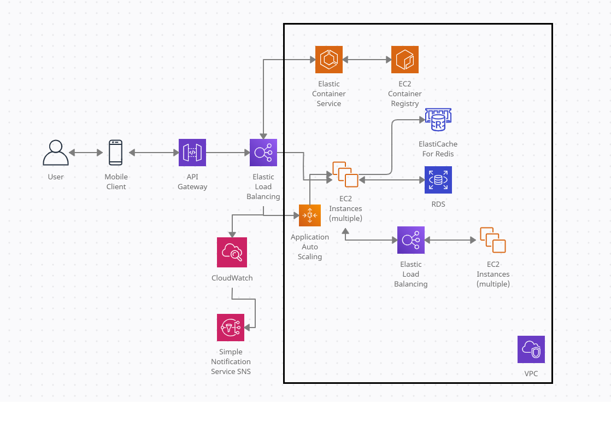

# Descrição
 Microserviço criado para cadastro de favorecidos.

## Estrutura
O projeto foi concebido utilizando os conceitos de clean arch e está dividido nos seguintes módulos:

 - **application**: contém os casos de uso, DTO's de request, response e exceptions.
 - **domain**: contém os domínios da aplicação e interface do repository.
 - **sboot**: contém as configurações do framework utilizado, spring e o controller para comunicação externa.
 - **dataprovider**: contém entidades, mappers e implementação do repository. 
 - **shared-vocabulary**: contém anotações criadas para substituir padrão do spring.

Dessa maneira os módulos **application** e **domain** ficam isolados caso haja uma troca de framework, banco e afins no futuro.

## Tecnologias

* Linguagem: [Kotlin](https://kotlinlang.org)
* JVM: [Java](https://sdkman.io/jdks#AdoptOpenJDK) 11 ou maior
* Compilação: [Gradle](https://gradle.org)
* Framework: [Spring Boot](https://spring.io/projects/spring-boot)
* Testes:
    * Testes unitários [jUnit5](https://junit.org/junit5/docs/current/user-guide/)
  
## Arquitetura 

Foi feito pensando em um microserviço só, 
integrando com os sistemas de autenticação do aplicativo e de movimentação financeira. 
De banco de dados, usaria mongodb (acabei deixando em h2 por simplicidade) para escalabilidade 
e para velocidade na hora de trazer as informações.



## Modelagem de dados

Como não vou ter as informações da conta que está cadastrando, 
somente um ID ou um UUID que representa a conta em outro serviço, 
optei por manter tudo em uma tabela só:

```
favorite_account {
    id_favorite_account - Long
    id_customer - Long 
    bank_account - String
    cod_agency - Int
    cod_document - String
    name_person - String
    dat_creation - Timestamp
    dat_update - Timestamp
}
```
## Observability

No começo deixo o básico:

  * Utilização do CPU > 70% 
  * Utilização da memória > 70%
  * Porcentagem de erro > 5% por X minutos.
  * Monitoração no healthcheck da aplicação.
  * Tempo de resposta de aplicações integradas.
  * Tempo de resposta de queries no banco de dados.

Com base na monitoração da porcentagem de erro iriam sendo definidos planos de ação.

## Building e Running a aplicação
### Building:

```
./gradlew clean build
```
### Testes:

- Todos os testes:

    ```
        ./gradlew check
    ```
  
- Testes unitários:
    ```
        ./gradlew test
    ```
    
- Testes de integração (marcados com `@Tag("integration")`)
    ```
        ./gradlew integrationTest
    ```

 ### Subindo a aplicação:

```
./gradlew bootRun
 ```
    
- Subindo a aplicação via IDE:
  
  ```
  kotlin/itau/favorecidos/sboot/Application.kt
  ```
  
- Gradle tasks disponíveis :
  
    ```
    ./gradlew tasks
    ```

## Utilização:
A aplicação sobe na porta 8087 e pode ser utilizado **cURL** para realizar chamadas ou o [postman](https://www.postman.com/).

Ex.:

Criação de favorecido:
````
curl --location --request POST 'http://localhost:8087/favorite' \
--header 'Content-Type: application/json' \
--data-raw '{
    "idCustomer": "1",
    "bankAccount": "1234",
    "codAgency": 0,
    "document": "74.063.458/0001-26",
    "namePerson": "Teste"
}'
````

Deleção de favorecido:
````
curl --location --request DELETE 'http://localhost:8087/favorite/1'
````

Listagem de favorecidos cadastrados por usuário:
````
curl --location --request GET 'http://localhost:8087/favorite/1'
````

Atualização de favorecido:
````
curl --location --request PUT 'http://localhost:8087/favorite/2' \
--header 'Content-Type: application/json' \
--data-raw '{
    "bankAccount": "51234",
    "codAgency": 1
}'
````